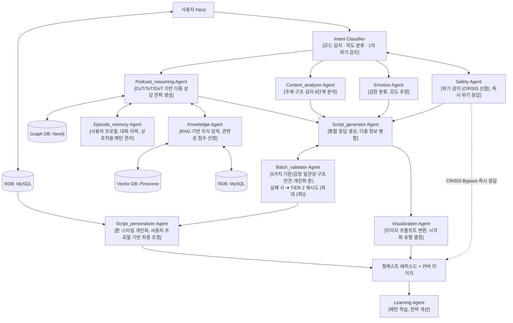

# Bloom AI 서비스의 Mind-Log AI Multi agent

초개인화 AI 멘탈케어 & 시각화 플랫폼

사용자의 감정과 생각을 AI가 분석하여 개인화된 멘탈케어 서비스를 제공하고, 내면 상태를 시각적 이미지로 표현합니다.

---

## 아키텍처

Mind-Log는 TIER 기반 멀티에이전트 시스템으로 팟캐스트 에피소드를 생성합니다.

### TIER 기반 파이프라인


```
TIER 0: Intent Classifier → 의도 분류 + 1차 위기 감지
TIER 1 (병렬 Fan-out): Safety + Emotion + Content Analyzer + Podcast Reasoning
TIER 2 (생성): Script Generator + Visualization (병렬)
TIER 3 (검증): Batch Validator (실패 시 TIER 2 재시도, 최대 2회)
대기: wait_for_stories (프론트엔드 Stories 데이터 수신 대기, 최대 300초)
TIER 4 (후처리): Script Personalizer
비동기: Learning Agent + Episode Memory 저장
```

| 항목 | 내용 |
|-----|------|
| 에이전트 | 11개 + Learning |
| 처리 방식 | TIER 병렬 + 배치 처리 |
| 출력 형식 | 구조화된 팟캐스트 스크립트 |

---

## 기술 스택

| 구분 | 기술 |
|------|------|
| LLM | Anthropic Claude (Opus 4.6, Sonnet 4, Haiku), AWS Bedrock, OpenAI (Qwen3-32B) / Ollama(개발용) |
| 오케스트레이션 | LangGraph StateGraph |
| 벡터 DB / RAG | Pinecone, KT Cloud RAG Suite |
| 관계형 DB | MySQL (PyMySQL) |
| 그래프 DB | Neo4j |
| 이미지 저장 | S3 / CDN |
| 모니터링 / 추적 | LangSmith (에이전트 트레이싱), Prometheus (메트릭 수집) |
| 프레임워크 | FastAPI + Uvicorn |
| CI/CD | GitHub Actions |

---

## 빠른 시작

```bash
# 1. 저장소 클론
git clone https://github.com/Ljun47/mind-log-ai.git
cd mind-log-ai

# 2. 가상환경 생성
python -m venv .venv
source .venv/bin/activate

# 3. 의존성 설치
pip install -r requirements.txt

# 4. 환경변수 설정
cp .env.example .env
# .env 파일에 API 키 입력

# 5. 테스트 실행
pytest tests/
```

---

## 프로젝트 구조

```
mind-log/
├── src/
│   ├── agents/           # 에이전트 구현
│   │   ├── podcast/      # 팟캐스트 에이전트 (11개 + Learning)
│   │   └── shared/       # 공용 인프라 (BaseAgent, LLMClient 등)
│   ├── models/           # AgentState, AgentMessage 스키마
│   ├── api/              # FastAPI 라우트 + 백엔드 API 클라이언트
│   ├── graph/            # LangGraph 워크플로우 정의
│   ├── monitoring/       # 콜백, 메트릭, 토큰 사용량 추적
│   ├── db/               # DB 연결 유틸리티
│   └── utils/            # 공통 유틸리티
├── config/               # 환경 설정 파일 (settings.yaml)
├── prompts/              # 에이전트 프롬프트 YAML (멀티버전)
├── tests/                # 테스트 코드 (563 passed, live 제외 기준)
├── docs/                 # 프로젝트 문서
└── CLAUDE.md             # AI 개발 가이드 (아키텍처 + 협업 규칙)
```

---

## 문서 안내

| 문서 | 설명 |
|------|------|
| [CLAUDE.md](CLAUDE.md) | 아키텍처 + 협업 규칙 + API 규약 통합 가이드 |
| [CONTRIBUTING.md](CONTRIBUTING.md) | 브랜치 전략, 커밋 컨벤션, PR 가이드, 담당 에이전트 배분, Protected Files |
| [docs/getting-started/QUICK_START.md](docs/getting-started/QUICK_START.md) | 환경 설정 및 첫 에이전트 개발 가이드 |
| [docs/architecture/AGENT_ROLES.md](docs/architecture/AGENT_ROLES.md) | 에이전트별 역할·입출력·이슈 정의서 |
| [docs/architecture/API_SPEC.md](docs/architecture/API_SPEC.md) | REST API 명세 인덱스 |

---

## 팀 구성

| 개발자 | 담당 에이전트 |
|--------|-------------|
| 이준 | Intent Classifier, Knowledge, Script Generator, Script Personalizer |
| 한가은 | Safety, Emotion, Visualization, Episode Memory |
| 이경신 | Podcast Reasoning, Content Analyzer, Batch Validator, Learning |


